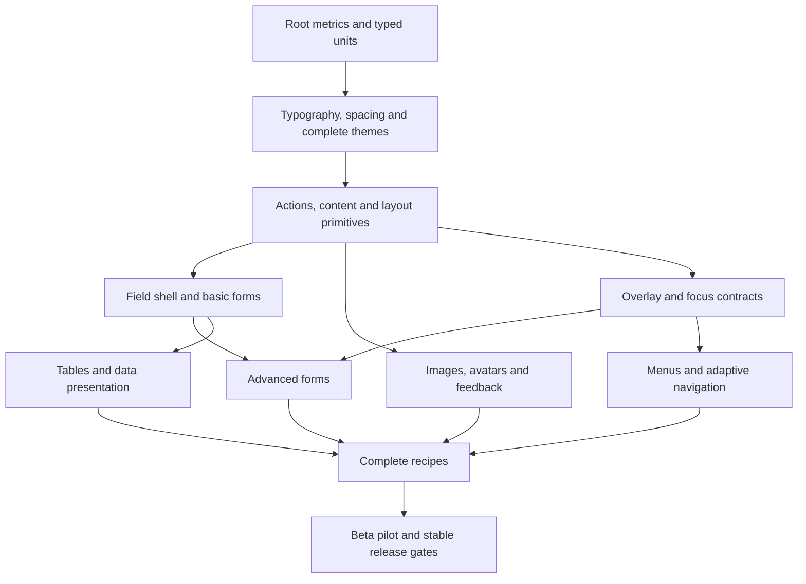

# Implementation, documentation, and release plan

This is the execution plan for the proposed specification. No framework code,
dependency, SDK pin, or lockfile is changed by this planning update.

## 1. Package and ownership boundaries

Keep the existing package architecture and public barrel files. Split growing
implementation files by responsibility rather than exposing internal folders.

| Package | Planned internal modules | Must not own |
| --- | --- | --- |
| `fw_core` | metrics, lengths, responsive, tokens, typography, theme, state styles, localization interfaces | Backend, routing, file picking, chart engine, preference storage |
| `fw_layout` | container, grid, stacks, visibility, scrolling/slivers, adaptive panes | Form state, upload transport, application navigation history |
| `fw_utilities` | typed insets, box/style resolution, effects, text/spacing helpers | A second competing theme or responsive resolver |
| `fw_components` | actions, content, media, forms, feedback, overlays, navigation, data | Mandatory state-management integration or service credentials |
| `fw` | Explicit exports and integration guides | Duplicate implementations |
| Optional adapters | Specific plugin integration and capability tests | Required imports into core |

Components may depend on layout/utilities when they genuinely use them. Do not
force an artificial dependency chain. Keep theme/metrics logic in core and
share it, so layout and utilities cannot drift into different rem rules.

Suggested implementation locations:

```text
packages/fw_core/lib/src/
  metrics/metrics.dart
  lengths/length.dart
  lengths/resolve.dart
  tokens/colors.dart
  tokens/spacing.dart
  tokens/radii.dart
  tokens/motion.dart
  typography/typography.dart
  theme/theme.dart
  theme/scope.dart
packages/fw_components/lib/src/
  actions/
  content/
  media/
  forms/
  feedback/
  overlays/
  navigation/
  data/
apps/gallery/lib/
  features/theme_playground/
  features/component_catalog/
  features/recipes/
```

Use small exports with no duplicate type names. Optional packages are created
only when a real adapter is implemented, tested, and documented; empty packages
do not improve modularity. Check public name availability before publishing.

## 2. Dependency order



Documentation, accessibility, testing and profiling run through every phase;
they are not deferred to a final cleanup sprint.

## 3. Phase 1 — units and design-system contracts

Do these tasks first and prove them using the current button/card/grid slice.

| ID | Task | Concrete deliverable and acceptance |
| --- | --- | --- |
| DS-01 | Record public sizing API | ADR for FwLength, root ownership, query selection, supported dimensions and validation; examples reviewed against real Flutter constraints |
| DS-02 | Implement root metrics and scalar lengths | Fixed px/rem and named token resolver; roots 16/18/20 verified; no device-pixel multiplier |
| DS-03 | Add responsive and fluid lengths | Endpoint/midpoint/clamp tests, invalid bounds rejected, parent-vs-viewport demonstration |
| DS-04 | Implement typography roles and font configuration | Scale from design-system document, fonts/fallback/weights, heading semantics and Material mapping |
| DS-05 | Prove TextScaler behavior | One-time scale application, nonlinear test case, large-text button/card/grid example without clipping |
| DS-06 | Add directional typed insets and semantic spacing | Token map, semantic aliases, responsive gaps/insets; root-16 parity and RTL tests |
| DS-07 | Complete semantic colors and state resolver | Status pairs, surfaces/text/border/focus, disabled/selected/invalid combinations with contrast tests |
| DS-08 | Implement theme/component scopes | Property-level precedence, nullable override semantics, root inheritance, nested Material-adapter propagation |
| DS-09 | Add radii/borders/shadows/motion/density | Explicit pixel vs rem roles, reduced-motion behavior, min tap-target invariants |
| DS-10 | Create tested theme presets | Default/Ocean/Forest/Sunset/Monochrome, light/dark and high-contrast policy; no unchecked raw color combinations |
| DS-11 | Migrate existing widgets | Existing root-16 behavior preserved or intentional visual changes documented; legacy pixel spacing migration |
| DS-12 | Publish design-system documentation and playground | Root/font/mode/brand/density controls, local scopes, rendered versus declared text explanation, offline fonts |

Exit gate: a branded page can change root size, heading font, spacing, and theme
without double-scaling text or losing the grid's constraint behavior. Freeze
this contract provisionally before building many new components.

## 4. Phase 2 — usable primitives and action system

Implement A01–A03/A07, T01/T03–T06, L01–L07, D01/D02, M01/M03/M05 and O05.

Tasks:

1. Extend Button with separated intent/variant and size metrics; document busy
   ownership and localized labels. Test keyboard, semantics and combined states.
2. Add icon actions, action/link behavior, badge/chip/divider and typography
   widgets. Define which elements are interactive before selecting semantics.
3. Migrate container/grid; implement stacks/wrap/auto-fit/visibility. Validate
   retained hidden state and stable keys during layout changes.
4. Add image/provider contracts and avatar fallback; prove offline and failure
   behavior using fakes before gallery network-image demos.
5. Extend card slots and explicit interactive wrapper; document nested actions.
6. Add field-independent surface primitives and a reusable component demo shell.

Exit gate: a responsive marketing/profile page composed entirely from the
framework's public API, with root changes, RTL and enlarged text demonstrated.

## 5. Phase 3 — basic forms and MVP feedback

Implement F01–F09/F12 and B01/B03–B07. Use the catalog's shared form/progress
contracts rather than creating different label/error conventions per control.

Implementation order:

1. Field shell and typed field state; label/helper/error layout and local theme.
2. Text input and textarea with controller lifecycle, autofill and validation.
3. Password input, checkbox/radio groups, switch and simple select.
4. Slider with value/commit semantics and numeric-domain validation.
5. Linear/circular progress, shared spinner model, skeleton and empty/error state.
6. Form submission/error-summary recipe with fake async callback and retry path.

Exit gate: settings/registration examples validate/save/reset, retain state
through theme/width changes, support keyboard and screen readers, and display
loading/error/success without ambiguous progress. This is the first MVP candidate.

MVP publication still requires installation/documentation/basic platform checks;
finishing this phase alone is not automatic approval to publish.

## 6. Phase 4 — overlay infrastructure and advanced forms

Implement O01–O07 and F10/F11/F13–F16. Add B02/B08 as their service/host behavior
depends on lifecycle and dismissal rules.

Create small internal interfaces/models for overlay result/dismissal reason,
focus restoration, anchored bounds, listbox selection and async query state.
Share these internally without prematurely publishing a universal controller.

Tasks: modal/confirmation/drawer first; tooltip/popover/menu next; combobox and
multi-select on the tested listbox; number/range/date/time fields; toast queue
and task-progress presentation. Use native date/time pickers for initial support
and clearly document the remaining customization limits.

Exit gate: complete confirmation and searchable-selection flows work with
keyboard, pointer, touch, back/Escape, nested themes, narrow windows, and a
visible software keyboard. Stale asynchronous results cannot corrupt selection.

## 7. Phase 5 — navigation and adaptive application structure

Implement A04–A06/A09, N01–N08 and L08–L10/L12. Shared navigation IDs, selection,
and disabled/current semantics are essential; do not duplicate selection state
in separate mobile and desktop widgets.

Build navbar/sidebar/rail/bottom navigation, tabs, breadcrumb/pagination, stepper,
then adaptive scaffold and master-detail recipes. Test route-neutral callback
contracts and publish routing examples. Preserve destination selection, field
state, detail selection and scroll position across responsive transitions.

Exit gate: one dashboard works as bottom navigation on phone, rail on medium
width, and sidebar on desktop, with identical destination state and usable long
labels. Menu/split-button interactions are independently tested.

## 8. Phase 6 — data display and media completion

Implement T02/T07/T08, M02/M04, B09 and D03–D07. Build a small-data table before
attempting virtualization; make mobile presentation a deliberate contract.

Tasks: accordion and lists; table schema and selection/sort callbacks; responsive
data cards/horizontal-scroll option; pagination integration; stat/timeline/figure;
avatar groups and code/keyboard helpers. Publish limits for collection size and
complex cell content. Advanced tree/virtualized grid/carousel/editor remain out
of the stable release scope unless the plan is explicitly revised.

Exit gate: a searchable/paginated data page can represent every essential field
and row action on phones, supports large text, and does not claim server-side
behavior that the application must supply.

## 9. Phase 7 — documentation, integration, and real-app beta

Convert accumulated docs/gallery pages into the final navigation below. Build
complete recipes from public exports and test them as applications. Add native
gallery targets in separate implementation changes, then validate platform
support on the appropriate runners; the current gallery is web-focused.

Run pilots in at least three representative interfaces: settings/forms, a
dashboard/data page, and a marketing/content page. They may be independently
built sample apps initially, but 1.0 should include evidence from real usage.
Record API friction, defects, accessibility findings, dependency/size impact,
and breaking-change candidates. Resolve critical findings before stable release.

## 10. Final documentation structure

| Section | Pages required |
| --- | --- |
| Start | Install, supported SDK/platforms, application setup, first responsive page, umbrella vs individual packages |
| Design system | Root/rem/em/pixel units, fluid values, responsive scopes, spacing, fonts/type, semantic colors, density, motion, shapes/shadows |
| Theming | Seed/brand preset, light/dark/system choice, component/local scopes, state styles, high contrast, custom fonts, preference adapter |
| Layout | Containers, grid math, stacks/wrap, auto-fit, visibility/state retention, safe area/keyboard, scrolling/slivers, adaptive panes |
| Components | Every required catalog family with overview, props, examples, variants, states, responsive behavior, a11y, lifecycle and limitations |
| Forms | Field lifecycle, controlled/uncontrolled use, validation timing, IME, form reset/save, error summary, localization, async suggestions |
| Media | Providers, responsive images, aspect reservation, decode/cache policy, CORS/offline/error, avatar naming/fallback, font licensing |
| Recipes | All recipes listed in the catalog; editable full source and expected behavior |
| Adapters | Installation/capabilities/platform limitations for each actual optional adapter |
| Quality | Accessibility responsibility, keyboard reference, text scaling, RTL, test recipes, profiling and supported platform matrix |
| Reference | Generated Dart API, token tables, component/state matrix, upgrade guides, changelog, known issues |
| Contribute | Architecture, local checks, new component checklist, PR/release flow, issue reporting and support policy |

### Template for each component page

Include: purpose and when not to use it; smallest compilable example; essential
properties and ownership; variants/sizes/states; theme/customization; responsive
and rem behavior; keyboard map; semantic/localization expectations; controller
and async lifecycle; failure/empty/loading cases; platform limits; full recipe;
related components; change history. Unsupported behavior is listed explicitly.

Examples must be compile-tested from the same source used by the gallery or an
example harness. Do not maintain attractive snippets that drift from the API.
API documentation documents nullable meaning, callback timing, default values,
ownership/disposal, argument validation and responsive measurement source.

Keep Markdown while APIs evolve. A VitePress/Docusaurus or other docs site is a
later tooling decision; avoid requiring Node to develop the Flutter libraries.
Deploy the gallery/docs only when explicitly authorized; version docs with
published package versions and preserve older upgrade guidance.

## 11. Testing strategy and mandatory matrix

| Layer | Mandatory checks | Implementation notes |
| --- | --- | --- |
| Unit | Length/root/token/state/contrast/progress/domain/selection logic | Boundary and invalid cases; nonlinear scaler; deterministic numeric tolerances |
| Widget | Actual interaction, layout, focus, form lifecycle, semantics | Fixed logical surface sizes; restore view/locale/controllers after test |
| Golden | Representative light/dark, states, narrow/wide, RTL, large text | Pinned Flutter/fonts/OS rendering; intended changes reviewed, not blindly accepted |
| Browser | Real rendered fonts/assets, actions, overlays, resize, keyboard | Chromium baseline; expand to supported browsers; Flutter semantics tree as well as screenshots |
| Device integration | Form/keyboard/back/overlay/media flow | Android/iOS runners; system accessibility and software keyboard behavior |
| Manual a11y | TalkBack/VoiceOver and desktop/browser screen-reader paths | Record platform/browser/version and behavior; automated matchers are partial proof |
| Performance | Build/layout/frame/image memory behavior | Profile/release mode on representative hardware, not debug timing |
| Packaging | Fresh app imports and release dry runs | Individual packages and umbrella, version constraints, dependency directions |

Use pairwise/representative combinations plus targeted high-risk intersections,
not every possible Cartesian product. Minimum examples include widths 320/390,
768/1024 and 1440; exact breakpoint boundaries are separately unit-tested.
Test 1×/1.5×/2× and nonlinear text scaling, long labels, RTL, reduced motion,
light/dark, busy/disabled/invalid/focused combinations where relevant.

Defaults target WCAG-relevant contrast and non-color cues. Normal text pairs
are checked at >=4.5:1; qualifying large text and non-text indicators have their
own applicable checks (typically >=3:1). High-contrast mode has explicit stronger
targets. Do not infer whole-application compliance from a palette test.

Use fake image providers, fake task/upload state and fake suggestion loaders.
No credentials, real user data, or live payment/upload services in normal CI.
Accessibility announcements are checked for meaningful timing and duplication.

### Performance acceptance

Establish baselines before setting regression limits. Record SDK, hardware,
renderer, viewport, item count, image dimensions, and warm/cold conditions.
Benchmark a representative grid/list and a long lazy collection; resizing;
forms with validation; utility wrappers vs composed styles; image decoding and
overlay opening. At 60Hz a frame budget is ~16.7ms, but final targets depend on
the supported device/profile. Publish actual measurements and limitations.

Do not add caching for inexpensive responsive resolution until profiling shows
a need. Any cache must invalidate on root/theme/density/width/locale changes.
Do not optimize by disabling accessibility, assertions, or essential content.

## 12. Definition of done for a component PR

1. Approved role/state/sizing contract and public API with no hidden app service.
2. Implementation uses shared tokens, lengths, state styles and native behavior.
3. Applicable interaction/lifecycle/error/boundary tests pass.
4. Semantic naming, keyboard map, RTL and enlarged text verified.
5. Representative goldens and gallery states exist; fonts are deterministic.
6. Complete component documentation and executable examples exist.
7. Public exports and dependencies are minimal; platform limitations stated.
8. No unresolved critical regressions or unexplained required-check failures.

Feature PRs should stay small enough to review: do not combine a length-system
breaking change with ten new widgets and a documentation-site migration.

## 13. Timeline and prioritization

Planning assumption: one experienced Flutter developer working full time,
including tests/docs, with timely design/API review. Estimates are ranges and
must be refined after the metrics prototype and advanced-form spike.

| Work block | Initial effort range | Dependency |
| --- | --- | --- |
| Design-system metrics/type/theme contract | 3–5 weeks | Foundation |
| Primitive/actions/layout/media expansion | 3–5 weeks | Design-system contract |
| Basic forms/progress/MVP recipes | 4–6 weeks | Primitives and field shell |
| Overlay/advanced form contracts | 5–8 weeks | Forms and focus infrastructure |
| Navigation/adaptive application structure | 3–5 weeks | Overlays and shared navigation model |
| Data/media completion and recipes | 4–6 weeks | Layout, fields, navigation |
| Platform/a11y/performance hardening and pilot | 4–8 weeks | Usable beta; some work continuous |

The first usable MVP is roughly another 10–16 developer-weeks. The scoped 1.0
requires approximately 26–43 developer-weeks of work before contingency; some
activities overlap, but testing/docs remain real work. Budget roughly 7–12
months for a solo stable release with feedback and fixes. This supersedes the
original report's optimistic full-library 10–12-week expectation.

A team may develop independent families in parallel after API contracts settle,
but adding people does not divide focus/a11y/platform work linearly. The current
planning task does not start parallel implementation or commit to deadlines.

If schedule tightens, cut explicit 1.x/adapter scope first. If more cuts are
needed, revise the 1.0 catalog openly; do not skip tests or quietly rename an
unfinished beta stable. Datepickers, comboboxes, menus, tables and resizable
layouts warrant early risk spikes rather than surprise work near release.

## 14. Release process and compatibility

Use coherent 0.x versions while public contracts change. An umbrella release
must reference compatible package versions. Initially aligned package versions
are easiest; independent releases require documented compatibility ranges and
automation. Publish dependencies before dependants and verify the umbrella.

Before each candidate: format/analyze/tests/build; example compilation; package
analysis; API-diff/changelog review; dependency/license inventory; release dry
run; clean-app installation; documented SDK/platform matrix. The current public
package names and project license are unresolved and block publication, not
planning or local implementation.

Maintain a supported minimum Flutter version, test it and the chosen latest
stable version, and update deliberately. Do not change the current SDK pin in
this planning update. New native APIs require explicit minimum-version review.

### Stable 1.0 gate

- Every `MVP` and `1.0` catalog contract is implemented or the scope was formally
  revised with rationale before announcing release.
- Length/typography/theme APIs are consistent and have migration guidance.
- Required package, gallery, browser and advertised-platform checks pass.
- Real-app pilots show the APIs work; critical a11y/lifecycle defects are closed.
- Docs/examples are complete, versioned and reproducible; fonts/assets licensed.
- Performance baselines and limits are published; no unexplained regressions.
- License, package names, contribution/support/security contact and changelog exist.
- Publication dry runs and fresh consuming-app installations succeed.

Optional adapters can remain unreleased without blocking core 1.0. A tested web
build is not evidence for all six Flutter targets; declare only verified support.
Publication/deployment are separate authorized actions, not effects of writing
this document or running a test.

## 15. After 1.0

Prioritize 1.x by real application demand: range/calendar sophistication, tree
and virtualized grid, carousel/lightbox, command palette, designer token import,
CLI and adapters. Keep incompatible experiments behind separate packages or
explicit experimental namespaces. Schedule maintenance, SDK compatibility and
accessibility fixes alongside features; a larger catalog is not the only goal.
